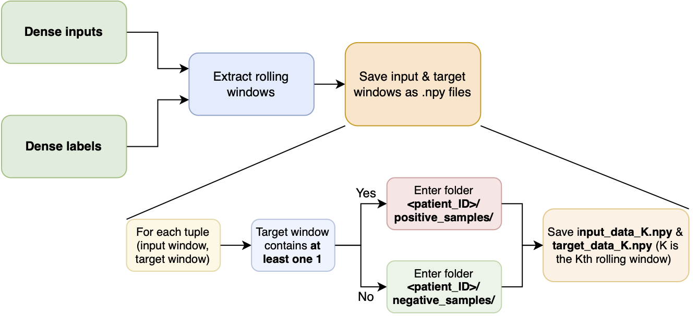
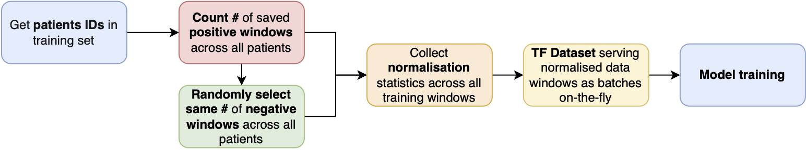

## ML for ICU Adverse Event Prediction

### Sliding Windows Implementation

#### System Design for Data Saving

#### Code Component Links

| Component                                     | Link                                            | 
| --------------------------------------------- | ----------------------------------------------- | 
| Notebook with Labeling Criteria Comparison    | [Link](notebooks/labeling_clinical_criteria.ipynb) | 
| Notebook with Elements of ML Pipeline         | [Link](notebooks/ML_pipeline_sandbox.ipynb)        |
| Dense Labeling MIMIC                          | [Link](ml_pipeline/dense_labeling_mimic.py)        |
| Labeling Config - Clinical YAML               | [Link](labeling_config.yaml)                       | 
| Common functions                              | [Link](common.py)                                  | 
| Input Dataset Normalization                   | [Link](ml_pipeline/dataset_statistics.py)          | 
| Re-labeling from Disease Onset Time           | [Link](ml_pipeline/time_series_relabeling.py)      |
| Saving Inputs & Targets as Rolling Window NPY | [Link](ml_pipeline/time_series_relabeling.py)      |
| Training/Test Config & Paths - User YAML      | [Link](training_test_config.yaml)                  |
| Dataset Generation                            | [Link](ml_pipeline/collate_dataset.py)             |
| Time Series Deep Models                       | [Link](ml_pipeline/models/time_series_models.py)   |
| Training Runner                               | [Link](runners/training_runner.py)                 |
| Testing Runner                                | [Link](runners/test_runner.py)                     |
| Evaluation Pipeline                           | [Link](ml_pipeline/evaluation.py)                  |

### Whole Patient Sequences Implementation

| Code Component                                | Link                                            | 
| --------------------------------------------- | ----------------------------------------------- | 
| Dense Labeling MIMIC                          | [Link](ml_pipeline/dense_labeling_mimic.py)        |
| Re-labeling from Onset or Diagnosis time      | [Link](ml_pipeline/whole_seqs_labeling.py)         |
| Labeling Config - Clinical YAML               | [Link](labeling_config.yaml)                       | 
| Common functions                              | [Link](common.py)                                  | 
| Collect Training Statistics & case-control matching | [Link](ml_pipeline/dataset_statistics.py)    | 
| Training Set Case-Control Matching            | [Link](ml_pipeline/dataset_statistics.py)    | 
| Saving Inputs & Targets as NPY                | [Link](ml_pipeline/dataset_statistics.py)          |
| Training/Test Config & Paths - User YAML      | [Link](training_test_config_whole_seqs.yaml)       |
| Dataset Generation                            | [Link](ml_pipeline/collate_dataset.py)             |
| Time Series Deep Models                       | [Link](ml_pipeline/models/models_whole_seqs.py)    |
| Training Runner                               | [Link](runners/whole_seqs_training.py)             |
| Testing/Plotting Runner                       | [Link](runners/plotter_results.py)                 |
| Test Set Case-Control Matching                | [Link](ml_pipeline/evaluation_whole_seqs.py)       |
| Save Model Predictions                        | [Link](ml_pipeline/evaluation.py)                  |
| K-Fold Training & Evaluation Runner           | [Link](runners/k_fold_runner.py)                   |